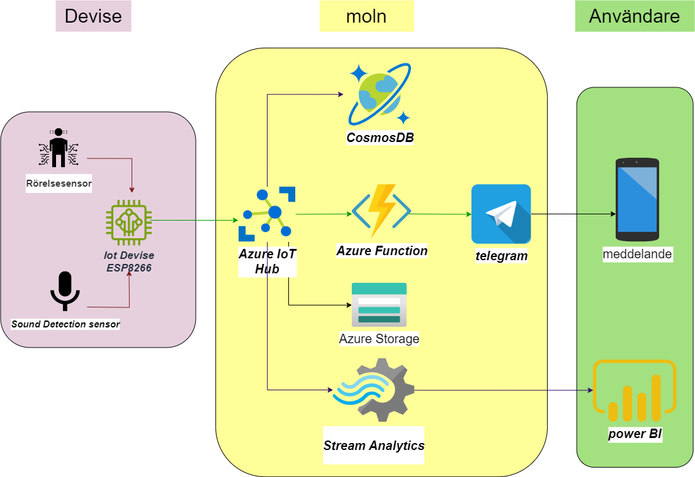
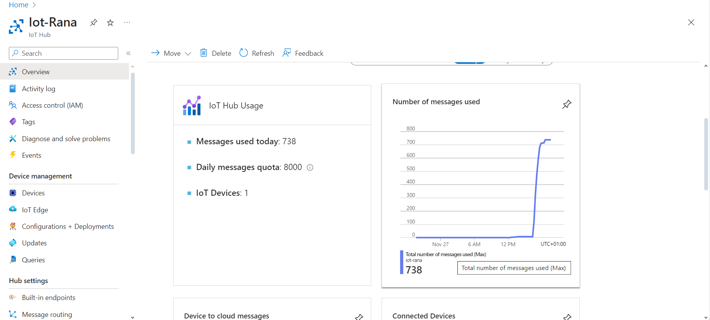
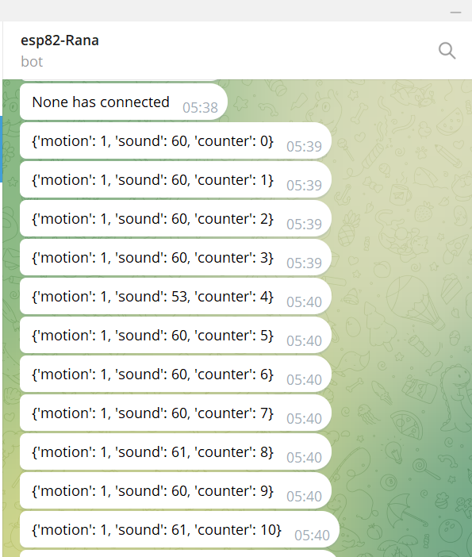

#IoT-och-Molntjanasten-projektet

<h1 align="center" id="top">Projekt om Azure IoT Hub med ESP8266</h1>

## Innehållsförteckning.

- [Projekt beskrivning](#projekt-beskrivning)
    - [Komponenter](#komponenter)
- [Översikt](#översikt)
- [Instruktioner](#instruktioner)
    - [Kopplingsschema](#kopplingsschema)
    - [Installation](#Installation)
- [Uppstart](#uppstart)
- [Säkerhet och skalbarhet](#Säkerhet-och-skalbarhet)
- [Sammanfatning](#sammanfatning)


## Projekt beskrivning
Projektet använder en ESP8266-mikrokontroller som en IoT-enhet för att samla in data från en PIR-sensor och en ljudsensor.
Denna enhet ansluter till Azure IoT Hub för molnbaserad kommunikation och lagring.
Från IoT Hub skickas data vidare till en Azure-funktion för vidare behandling och för att skicka meddelanden till en Telegram-bottjänst, Samtidigt lagras data i Cosmos DB för mer detaljerad information och användning av Azure Stream Analytics för realtidsanalys.
Den analyserade datan visualiseras i Power BI.

### Komponenter

- Sensorer: PIR-sensor(HC-SR501), ljudsensor( KY-037).
- IoT-enhet: ESP8266-mikrokontroller för datainsamling.
- IoT Hub: Azure IoT Hub för molnbaserad kommunikation och lagring.
- Azure-funktion: Behandlar data och skickar meddelanden till Telegram.
- Telegram: Meddelandeservice för att informera användare om händelser.
- Cosmos DB: Lagrar data för detaljerad information.
- Stream Analytics: Molnbaserad strömanalys för realtidsdataanalys.
- Power BI: Visualiserar analyserad data för användaren.

<p align="right">(<a href="#top">tillbaka till toppen</a>)</p>

## Översikt   




Projektet syftar till att övervaka rörelse och ljudnivå i en given miljö för att förbättra säkerheten och automatisera åtgärder baserat på upptäckta händelser.<br>


<p align="right">(<a href="#top">tillbaka till toppen</a>)</p>

## Instruktioner

### Kopplingsschema
Kopplingen beror på vilken version av ESP8266 och ljud- och rörelsesensorer du har. För en ESP8266-1 med en ljudsensor och en rörelsesensor kan kopplingen vara följande:


<br>


<br>

<p align="right">(<a href="#top">tillbaka till toppen</a>)</p>

### Installation

-För att installera och använda de nödvändiga biblioteken i Arduino IDE för projektet.

1. Ladda ner och installera den senaste versionen av Arduino IDE från Arduino:s officiella webbplats.
2. Installera ESP8266-kortpaketet i Arduino IDE genom att följa instruktionerna. (http://arduino.esp8266.com/stable/package_esp8266com_index.json) .
3. Installera [Azure SDK]för C-bibliotek(https://github.com/Azure/azure-sdk-for-c-arduino) , Följande bibliotek kommer också att installeras automatiskt som en del av Azure IoT-biblioteket: AzureIoTHub, AzureIoTUtility, AzureIoTProtocol_MQTT.
4. Installera [ArduinoJson] från Arduino biblioteket eller (https://github.com/bblanchon/ArduinoJson) .
5. Installera [PubSubClient] från Arduino biblioteket eller (https://github.com/knolleary/pubsubclient) .


<p align="right">(<a href="#top">tillbaka till toppen</a>)</p>

## Uppstart

1-User och sensor:
En användare använder en sensor (som rörelse- och ljudsensorerna i ditt projekt) för att generera data.

2-IoT Device:
En IoT-enhet (din ESP8266-enheter från ditt projekt) är ansvarig för att samla in data från sensorerna.

3-IoT Hub:
Enheten skickar data till Azure IoT Hub.





Konfigurera ditt projekt med nödvändiga uppgifter som WiFi-anslutning, Azure IoT Hub FQDN, enhets-ID och enhetsnyckel.

```
// Wifi
#define IOT_CONFIG_WIFI_SSID "SSID"
#define IOT_CONFIG_WIFI_PASSWORD "PWD"
```
-uppdatera din anslutningsinformation i filen config.h.


```
// Azure IoT
#define IOT_CONFIG_IOTHUB_FQDN "[your Azure IoT host name].azure-devices.net"
#define IOT_CONFIG_DEVICE_ID "Device ID"
#define IOT_CONFIG_DEVICE_KEY "Device Key"
```
<br>

4-Cosmos DB:
Konfigurera en Cosmos DB-databas för att lagra de analyserade sensordata.


<br>
<br>
5-Azure Storage:
Azure Storage fungerar som den utsedda plattformen för fillagringsbehov. All data som genereras av Azure IoT Hub lagras effektivt i en angiven behållare i JSON-format. Detta utnyttjar Azure Storages kapacitet för högtillgänglig, skalbar och säker molnlagring av olika dataobjekt.

<br>

<br>
```
{"EnqueuedTimeUtc":"2023-11-29T16:54:24.0950000Z","Properties":{},"SystemProperties":{"connectionDeviceId":"esp82","connectionAuthMethod":"{\"scope\":\"device\",\"type\":\"sas\",\"issuer\":\"iothub\",\"acceptingIpFilterRule\":null}","connectionDeviceGenerationId":"638361874986776560","contentType":"application/json;charset=utf-8","enqueuedTime":"2023-11-29T16:54:24.0950000Z"},"Body":{"motion":1,"sound":52,"counter":1}}
```
<br>
6-Azure Function:
Anslut en Azure-funktion till IoT Hub med hjälp av Event Grid eller andra metoder för att lyssna på inkommande data.
Konfigurera Azure-funktionen för att bearbeta och analysera den inkommande sensordatan.


```
//import azure.functions as func
//from azure.cosmos import CosmosClient
```

7-Telegram:
Inom Azure-funktionen kan du integrera Telegram för att skicka meddelanden. Detta kan göras med hjälp av Telegrams API och rätt autentiseringsnycklar.


```
//telegram_token = "telegram_token"
//chat_id = "chat_id"
//telegram_url = f"https://api.telegram.org/bot{telegram_token}/sendMessage?chat_id={chat_id}&text={message}"
```
<br>



8-IoT Hub Stream Analytics:

Skapa en Stream Analytics-jobb i Azure Portal som lyssnar på dataströmmen från IoT Hub.
Konfigurera regler för att filtrera och bearbeta den önskade informationen.


9-Power BI:
Använd Power BI för att ansluta till Stream Analytics och skapa realtidsdiagram och visualiseringar av sensordatan.


<a href="bilder/PowerBI-projekte.pdf" target="_blank">Öppna PDF</a>


<p align="right">(<a href="#top">tillbaka till toppen</a>)</p>

## Säkerhet och Skalbarhet

För ökad säkerhet och skalbarhet i detta projekt skulle det vara fördelaktigt att införliva ett antal åtgärder.

Azure Device Provisioning Service effektiviserar introduktionsprocessen för IoT-enheter, automatiserar registrering och tillhandahåller centraliserad nyckel- och certifikathantering. Detta stärker inte bara säkerheten utan förenklar även driftsättningen av nya enheter, vilket bidrar till projektets skalbarhet.

Implementering av Azure Key Vault, certifikat och Hardware Security Modules (HSM) är avgörande för att skydda känslig information som nycklar och lösenord. Detta säkerställer att konfidentiell data inte exponeras i firmware eller laddas upp till arkiv.

Att utnyttja Azures skalbara och flexibla betalningsplaner möjliggör dessutom kostnadseffektiv skalning baserat på användningsmönster. Dessutom bidrar de inneboende IoT-säkerhetsfunktionerna som tillhandahålls direkt från Azure-hubben till en robust säkerhetsställning för hela systemet.

Implementering av MQTTS-protokollet (MQTT Secure). MQTTS förbättrar dataöverföringssäkerheten genom att lägga till kryptering. I projektet är detta tillämpligt när IoT-noder, såsom Node-MCU ESP8266, utbyter data med Azure IoT Hub med hjälp av MQTT-protokollet. Datakryptering säkerställer säker informationsöverföring, vilket minimerar riskerna för avlyssning eller obehörig åtkomst.

Se till att din Telegram-bottoken är lagrad på en säker plats, till exempel Azure Key Vault. Att säkra Telegram Bot-token förhindrar dess läckage och oavsiktlig användning. Detta är en kritisk säkerhetsaspekt som bör beaktas under projektets genomförande.

Genom att anta dessa åtgärder mildrar projektet inte bara sårbarheter och obehörig åtkomst utan skapar också en grund för säker och skalbar IoT-verksamhet.

## Sammanfatning

Projektet integrerar ESP8266 med Azure IoT Hub för övervakning av rörelse och ljudnivå. Data analyseras och lagras i Cosmos DB, och användare informeras via Telegram-bottjänsten. Visualisering utförs i realtid med hjälp av Power BI. Projektet möjliggör en omfattande lösning för övervakning och analys av miljöförhållanden.

<p align="right">(<a href="#top">tillbaka till toppen</a>)</p>
